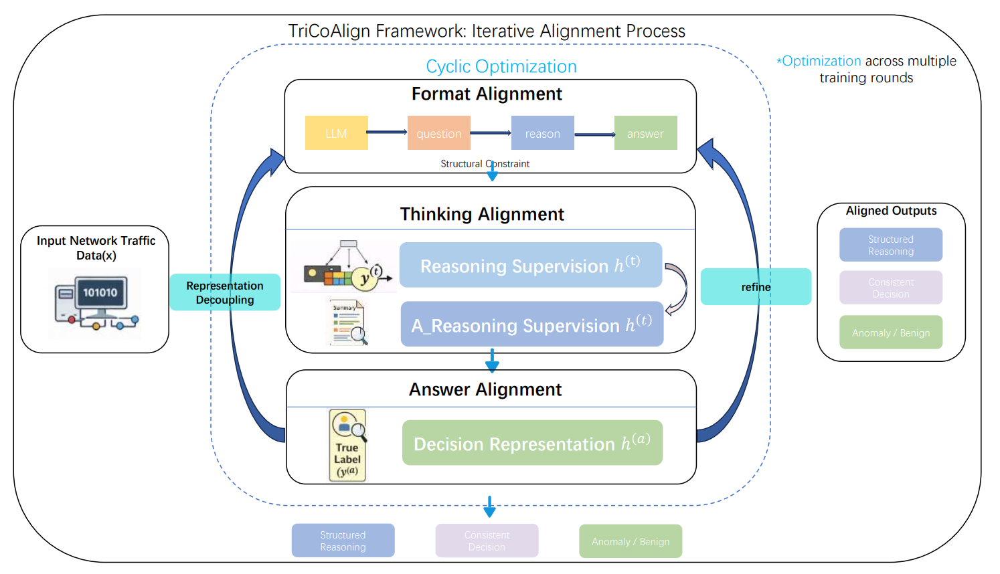

# TriCoAlign: Cyclic Alignment for Stabilizing LLMs in Network Intrusion Detection

[](LICENSE)
[](https://huggingface.co/PHZane/TriCoAlign-0.5B) <!-- 请确认实际模型链接 -->

## 📌 Overview

**TriCoAlign** is a novel triple-alignment framework designed to enhance the reliability and stability of Large Language Models (LLMs) in **Network Intrusion Detection Systems (NIDS)**.

While LLMs possess strong reasoning capabilities, they often suffer from **unstable inference behaviors** and **inconsistent decision outcomes** when applied to security tasks. TriCoAlign addresses these challenges by jointly aligning three complementary aspects in a cyclic manner:
1.  **Format Alignment**: Enforces structured "Question-Reasoning-Answer" outputs to decouple semantic roles.
2.  **Thinking Alignment**: Utilizes reasoning summarization to suppress noisy trajectories and focus on security-critical features.
3.  **Answer Alignment**: Constrains the decision space to ensure discriminative and consistent predictions.

Extensive evaluations on **NSL-KDD**, **CIC-IDS**, and **UNSW-NB15** demonstrate that TriCoAlign significantly outperforms baseline LLMs in detection accuracy, F1-score, and decision consistency.


*Figure 1: The TriCoAlign framework iteratively optimizes format, thinking, and answer alignments to stabilize LLM reasoning for intrusion detection.*

---

## 🚀 Key Features

-   **🛡️ Enhanced Stability**: Mitigates the "over-thinking" and inconsistent prediction problems common in raw LLMs.
-   **🔄 Cyclic Optimization**: A unified training strategy that progressively reduces reasoning-induced variability.
-   **📊 SOTA Performance**: Achieves up to **99.8% Accuracy** and **99.9% F1-Score** on the CIC-IDS dataset.
-   **🧠 Interpretable Reasoning**: Generates concise, security-focused reasoning traces rather than redundant chains of thought.
-   **📦 Easy Deployment**: Provides fine-tuned models and evaluation scripts for immediate testing.

---

## 📂 Project Structure

```bash
TriCoAlign/
├── readme_img/               # Framework diagrams and result plots
│   └── frame.png             # Illustration of the cyclic alignment pipeline
│
├── testdatasets/             # Sample datasets for quick testing
│   ├── NSL-KDD_sample.csv
│   ├── CIC-IDS_sample.csv
│   └── UNSW-NB15_sample.csv
│
├── src/                      # Source code for training and inference
│   ├── model.py              # TriCoAlign model definition
│   ├── trainer.py            # Cyclic alignment training loop
│   └── utils.py              # Data preprocessing and evaluation metrics
│
├── scripts/
│   ├── train_tricoalign.sh   # Script to launch full training
│   ├── evaluate.sh           # Evaluation script on benchmark datasets
│   └── original_model_test.py# Baseline script: Raw LLM performance without alignment
│
├── TriCoAlign_test.py        # Main evaluation script for the proposed framework
├── requirements.txt          # Python dependencies
└── README.md
```

---

## 📈 Performance Highlights

We evaluated TriCoAlign against representative LLM baselines (Qwen2.5-7B, GLM-4, ChatGPT-OSS) on three standard benchmarks.


*TriCoAlign consistently achieves high precision and recall, effectively forming clear decision boundaries where baseline models fail.*

---

## 🛠️ Installation & Usage

### 1. Environment Setup

```bash
git clone https://github.com/Zaneph1/TriCoAlign.git
cd TriCoAlign
pip install -r requirements.txt
```

### 2. Model Availability

We provide the fine-tuned **TriCoAlign-0.5B** model on Hugging Face for easy inference:

🔗 **[Download Model: PHZane/TriCoAlign-0.5B](https://huggingface.co/PHZane/TriCoAlign-0.5B)**

### 3. Quick Inference

Run the main evaluation script to test the framework on sample data:

```bash
python TriCoAlign_test.py --dataset testdatasets/NSL-KDD_sample.csv --model_path ./models/tricoalign-0.5b
```

To compare with a raw baseline model (without alignment):

```bash
python original_model_test.py --dataset testdatasets/NSL-KDD_sample.csv --base_model qwen2.5-7b
```

---

## 🔬 Methodology Details


---

## 🤝 Contributing

We welcome contributions to improve the framework, add support for new datasets, or optimize the alignment strategies. Please feel free to submit issues or pull requests.

## 📞 Contact

For questions or collaboration opportunities, please contact:
-   **Corresponding Author**: Junfeng Peng (pengjunf@mail2.sysu.edu.cn)
-   **GitHub Issues**: [Open an issue](https://github.com/Zaneph1/TriCoAlign/issues)

---

*Licensed under the MIT License.*
